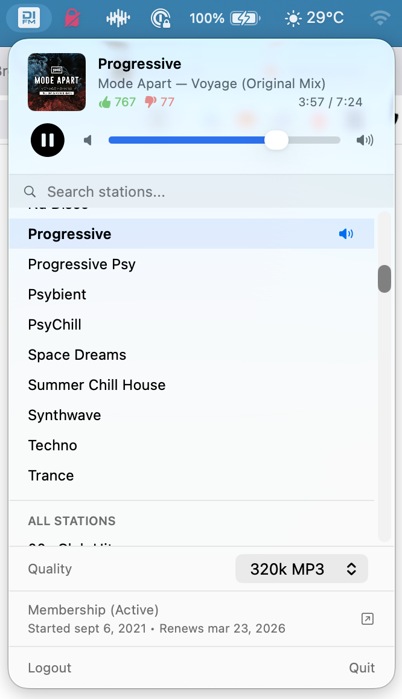

# DIBar

**A native macOS menu bar app for [DI.FM](https://di.fm) internet radio.** Built entirely in Swift and SwiftUI — no Electron, no Chromium, no web views. Sits quietly in your menu bar using virtually zero CPU when idle and just a few MB of RAM.



## Features

- **Menu bar native** — lives in your status bar, never touches the Dock
- **500+ channels** of electronic music from DI.FM
- **Stream quality selection** — 320k MP3, 128k AAC, or 64k AAC
- **Now playing** — album art, artist, track title, elapsed time, duration, and listener votes
- **Station search** — instant filtering across all channels
- **Favorites** — pin your go-to stations to the top of the list
- **Media key support** — play/pause from your keyboard; integrates with macOS Now Playing
- **Remembers your station** — automatically resumes your last channel on launch
- **Membership management** — view subscription status and renewal dates
- **Expandable artwork** — click the album art to see it full-size

## Why native?

| | DIBar | Typical Electron app |
|---|---|---|
| **App size** | ~2 MB | 150–300 MB |
| **RAM at idle** | ~15 MB | 200–500 MB |
| **CPU at idle** | 0% | 0.5–2% |
| **Startup** | Instant | 2–5 seconds |

DIBar uses `AVPlayer` for audio, `MPRemoteCommandCenter` for media keys, and SwiftUI `MenuBarExtra` for the interface. No runtime overhead from bundled browsers.

## Requirements

- macOS 14.0 (Sonoma) or later
- A [DI.FM](https://di.fm) premium membership for high-quality streaming

## Download App

- Latest release: <https://github.com/drmikexo2/DIBar-macOS/releases/latest>
- Download asset: `DIBar-v0.1.0-macOS.zip`

### Launch Notes (Unsigned Build)

This release is not notarized. If macOS warns on first launch:

1. Right-click `DIBar.app`
2. Click `Open`
3. Confirm in the prompt

## Download Source Code

- Main branch ZIP: <https://github.com/drmikexo2/DIBar-macOS/archive/refs/heads/main.zip>
- Main branch TAR.GZ: <https://github.com/drmikexo2/DIBar-macOS/archive/refs/heads/main.tar.gz>

Or clone:

```bash
git clone https://github.com/drmikexo2/DIBar-macOS.git
cd DIBar-macOS
```

## Build From Source

```bash
xcodebuild -project DIBar.xcodeproj -scheme DIBar -configuration Release build
```
